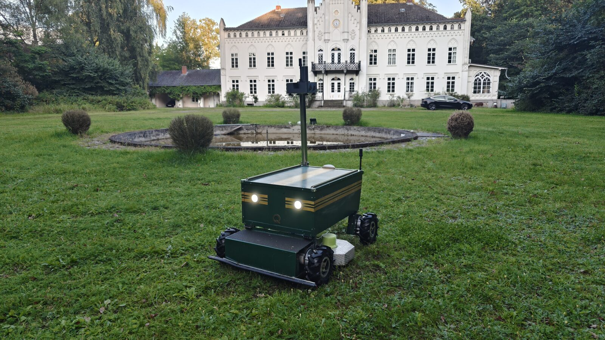

# 🚁 Quassel UGV - RTK-GPS + WitMotion Sensor Hub + WebApp

[](images/main.jpg)

> Start here for the current vehicle: **[`CURRENT_PRODUCTION.md`](CURRENT_PRODUCTION.md)**
>
> More photos with descriptions: **[`images/README.md`](images/README.md)**

A professional autonomous UGV system with an Orange-Pi-based sensor hub, RTK-GPS positioning, WitMotion IMU orientation, redundant WiFi telemetry, direct ODrive USB control, and a real-time web interface.

> **Authoritative production state:** the GNSS receiver is attached to the
> Raspberry over USB serial and RTK corrections arrive by NTRIP. Both ODrive
> boards use two direct USB/Fibre links. The CAN bus and the separate SensorHub
> are removed, code included. Do not reintroduce either.
>
> Sections below that still describe the Orange Pi SensorHub are stale and
> await the physical details of the new arrangement.

## 🎯 Project Overview

This project implements a complete autonomous UGV system featuring:
- **Dual-antenna RTK-GPS** (Holybro UM982) for precise positioning and heading
- **WitMotion USB-IMU** for roll/pitch/yaw orientation
- **Direct ODrive USB control** with current, error and watchdog diagnostics
- **Redundant HTTP/WiFi SensorHub telemetry** over two persistent streams
- **Real-time Web Interface** with Bing Maps satellite view
- **Modular Architecture** with Orange Pi Zero 2W sensor hub and Pi 3 controller

### ✅ Project Status: **ACTIVE DEVELOPMENT**
- ✅ Sensor hub architecture (Orange Pi Zero 2W, RTK/IMU and WiFi telemetry)
- ✅ RTK-GPS + IMU integration
- ✅ Two direct ODrive USB/Fibre connections
- ✅ Web interface framework
- ✅ WitMotion-based IMU telemetry on the sensor hub

## 🏗️ System Architecture

### Hardware Architecture

```
┌─────────────────────────────────────────┐
│  MAST (Orange Pi Zero 2W)               │
│  ├─ Holybro UM982 (Dual-Antenna RTK)    │
│  │  └─ USB Serial (/dev/serial/by-id)   │
│  ├─ WitMotion USB-IMU                   │
│  │  └─ USB Serial (/dev/serial/by-id)   │
│  └─ SensorHub HTTP API                  │
└─────────────────────────────────────────┘
            │
            │ HTTP/WiFi telemetry
            ▼
┌─────────────────────────────────────────┐
│  CHASSIS (Pi 3 + Motor Control)         │
│  ├─ WebApp (Python-based)               │
│  ├─ 2× direct ODrive USB/Fibre          │
│  │  └─ 3 used axes by serial + index    │
│  └─ WLAN Access Point                   │
└─────────────────────────────────────────┘
            │
            │ WLAN
            ▼
    [ Browser-Client ]
```

### Production Transport Assignment

Everything hangs off the Raspberry directly. There is no bus and no second
computer in the loop.

| System | Active transport | Profile |
|--------|------------------|---------|
| GNSS receiver → Raspberry | USB serial | port via `/dev/serial/by-id` |
| RTK corrections → Raspberry | NTRIP over cellular | mountpoint `openrtk_mv` |
| Raspberry → ODrive boards | Two direct USB/Fibre links | serial number + axis index |

### Physical Vehicle Layout

- **Vehicle length**: approx. **115 cm**
- **Vehicle width incl. wheels**: approx. **79 cm**
- **Vehicle height without mast**: approx. **60 cm**
- **Additional mast height incl. enclosure**: approx. **70 cm**
- **Overall height with mast**: approx. **130 cm**
- **Payload / ride-on capability**: the platform is large and robust enough that **one person can ride on it**

**Sensor placement:**
- **Mast position**: rear left on the vehicle
- **Primary GPS antenna**: mounted on the mast, rear left, at approx. **130 cm** height
- **Secondary GPS antenna**: mounted rear right directly on the housing at approx. **60 cm** height
- **Distance between GPS antennas**: approx. **51 cm**
- **Side inset of both GPS antennas**: approx. **14 cm** inboard from the left/right vehicle edge
- **Rear inset of both GPS antennas**: approx. **10 cm** forward from the rear edge
- **IMU position**: mounted at the top of the mast

### Software Stack

**Orange Pi Zero 2W (Sensor Hub):**
| Component | Function | Interface |
|-----------|----------|-----------|
| UM982 GPS | RTK Position + Dual-Antenna Heading | USB Serial /dev/serial/by-id |
| WitMotion USB-IMU | 9-DoF IMU incl. orientation frames | USB Serial |
| `sensor_hub_app.py` | Web API + redundant HTTP telemetry + sensor status | Systemd Service |

**Data Flow:**
- GPS-NMEA reading (pyserial)
- IMU data reading (pyserial / WitMotion binary protocol)
- Sensor telemetry (Position + Heading + Roll/Pitch/Yaw)
- Two persistent NDJSON telemetry streams over HTTP/WiFi

**Pi 3 (Controller + WebApp):**
| Component | Function |
|-----------|----------|
| Python WebApp | Flask/FastAPI |
| ODrive USB/Fibre | Controls three axes and reads errors/current directly |
| SensorHub HTTP client | Receives RTK/IMU telemetry over WiFi |
| WebSocket/SSE | Real-time push to browser |
| Bing Maps API | Map display |

**WebApp Features:**
- 🗺️ Bing Maps Satellite View (Lübtheen-optimized)
- 📍 GPS Position (Live marker)
- 🧭 Heading Display (Dual-antenna)
- 📊 RTK Status (No Fix / Float / Fixed)
- 🛤️ Trail/Path (last N positions)
- 📐 Roll/Pitch/Yaw from IMU

## 🛠️ Development Tools (`tools/`)

Deployment and ODrive configuration utilities; see `tools/README.md`.

## 🚀 Quick Start

### 1. Install Dependencies on Raspberry Pi 3 (Controller)
```bash
# Install web framework and the GNSS serial dependency
pip3 install -r raspberry_pi/motor_controller/requirements.txt
```

### 3. Setup Sensor Hub (Orange Pi Zero 2W)
```bash
# Upload current sensor hub
scp -r sensor_hub nicolay@orangeugv:/home/nicolay/

# Follow the tested deploy guide
ssh nicolay@orangeugv
cd /home/nicolay/sensor_hub
sudo systemctl start sensor-hub.service
```

### 4. Setup Controller (Pi 3)
```bash
# Upload web app
scp web_app.py nicolay@raspberrycan:/home/nicolay/

# Start web interface
python3 web_app.py
# Access at http://raspberrycan:80
```

## 📋 Hardware Configuration

### Vehicle Geometry / Sensor Placement

- **Length**: approx. **115 cm**
- **Width incl. wheels**: approx. **79 cm**
- **Height without mast**: approx. **60 cm**
- **Mast incl. enclosure**: additional approx. **70 cm**
- **Mast location**: **rear left**
- **Upper GPS antenna**: rear left on mast, approx. **130 cm** above ground
- **Lower GPS antenna**: rear right on housing, approx. **60 cm** above ground
- **GPS antenna baseline**: approx. **51 cm**
- **Lateral antenna inset**: approx. **14 cm** from each outer side edge (`(0.79 m - 0.51 m) / 2`)
- **Rear antenna inset**: approx. **10 cm** from the rear edge
- **IMU**: mounted on top of the mast
- **Ride-on capability**: one person can ride on the vehicle

### Sensor Hub (Orange Pi Zero 2W)
- **MCU**: Allwinner H616
- **GPS**: Holybro UM982 (Dual-antenna RTK)
  - USB serial via `/dev/serial/by-id/...`
- **IMU**: WitMotion USB-IMU
  - USB serial via `/dev/serial/by-id/...`
- **Operating System**: DietPi / Debian-based
- **Network**: HTTP/WiFi to the Raspberry controller via the Fritzbox port forward

### Controller (Pi 3)
- **MCU**: Broadcom BCM2837 (ARM Cortex-A53 Quad-Core)
- **Mower interface**: two direct USB/Fibre links to ODrive Board A/B
- **Motor Control**: GPIO 18/19 (Hardware-PWM)
- **Operating System**: Raspberry Pi OS (Debian-based)
- **Network**: WiFi + SSH access (nicolay@raspberrycan)

### Sensor Hub Device Usage (Orange Pi Zero 2W)
**USB Devices:**
- **Holybro UM982**: USB serial GNSS (`/dev/serial/by-id/...`)
- **WitMotion IMU**: USB serial IMU (`/dev/serial/by-id/usb-1a86_USB_Serial-if00-port0`)

### GPIO Pin Configuration (Pi 3 - Controller)
**Motor Control:**
- **GPIO 18**: Right Motor PWM Output (Hardware-PWM)
- **GPIO 19**: Left Motor PWM Output (Hardware-PWM)

**Relay Control:**
- **GPIO 22**: Light Control Relay Output (HIGH = On, LOW = Off)
- **GPIO 23**: Mower Control Relay Output (HIGH = On, LOW = Off)

**Safety:**
- **GPIO 17**: Emergency Stop/Safety Switch Input (pulled high, active low)
- **GPIO 12**: Mower Speed PWM Output (24-100% Duty Cycle, 1000Hz, 3.3V GPIO)

### Mower Speed Control (PWM-to-Analog Conversion)

The mower speed control uses PWM-to-analog conversion via RC filter circuit:

**Circuit Configuration:**
```
GPIO12 (PWM) ----[1kΩ]----+-----> Analog Output (to Mower Controller)
                           |
                         [15µF]
                           |
                         GND
```

**PWM Specifications:**
- **Frequency**: 1000Hz
- **Duty Cycle Range**: 24-100% (optimized for 3.3V GPIO)
- **Output Voltage Range**: 0.8V - 3.3V
- **Speed Mapping**: 0% = 0.8V (idle), 100% = 3.3V (full speed)

**RC Filter Analysis:**
- **Time Constant**: τ = 1kΩ × 15µF = 15ms
- **Smoothing Factor**: 15x PWM period (excellent filtering)
- **Ripple**: <1% of output voltage

## 🔧 Key Features

### Sensor Integration
- **Dual-Antenna RTK-GPS** (Holybro UM982)
  - Precise positioning (cm-level accuracy)
  - Dual-antenna heading (no compass needed)
  - NMEA output via UART
- **WitMotion USB-IMU**
  - Accelerometer + Gyroscope + orientation frames
  - Roll/Pitch/Yaw orientation
  - USB serial interface

### Sensor Hub Telemetry
- **Real-time position tracking** with RTK-GPS
- **Heading calculation** from dual-antenna GPS
- **Native orientation data** from the WitMotion IMU
- **Redundant HTTP/WiFi streaming** to the controller

### Web Interface
- **Bing Maps satellite view** (Lübtheen-optimized)
- **Live GPS marker** with real-time updates
- **Heading indicator** (dual-antenna)
- **RTK status display** (No Fix / Float / Fixed)
- **Trail visualization** (last N positions)
- **Roll/Pitch/Yaw display** from IMU
- **WebSocket real-time updates** (50Hz)

### Motor Control
- **2-channel Hardware-PWM output** (1000-2000μs pulse width)
- **Freeze-resistant PWM generation** using pigpio hardware timers
- **Real-time monitoring** with live percentage and PWM display
- **Intelligent Ramping System** for smooth acceleration and quick braking

### Safety Features
- **Hardware-PWM independence** (continues running if Python crashes)
- **Command timeout monitoring** (2-second timeout → automatic neutral)
- **Emergency stop functionality** with signal handlers
- **Two-stage SensorHub fail-safe**: a short telemetry loss pauses drive and
  route while leaving the mower deck running; a sustained loss latches the
  full stop. An autonomous route resumes automatically after fresh telemetry;
  ODrive USB loss still stops immediately.
- **Mower overcurrent monitor**: native USB telemetry is polled at 10 Hz for
  nodes 0/1/2; 25 A for 0.5 s or 29 A for 0.1 s latches the same stop
- **Local ODrive watchdog**: each used axis must have a 1.0 s watchdog enabled,
  so the mower disarms even when a broken USB link prevents an IDLE command
- **Manual reset**: the web UI shows `STOPP`; reset is accepted only after the
  all USB axes are healthy and no non-watchdog ODrive error remains
- **Service integration** with automatic restart on failure

## 🎮 System Commands

### Sensor Hub (Orange Pi Zero 2W)
```bash
# Start sensor hub service
sudo systemctl start sensor-hub.service

# View sensor data
sudo systemctl status sensor-hub.service

# Verify the local telemetry stream
curl -N --max-time 3 http://127.0.0.1/api/telemetry/stream

# View logs
journalctl -u sensor-hub -f
```

### Controller (Pi 3)
```bash
# Start web interface
python3 web_app.py

# Access web interface
# http://raspberrycan:80

# Inspect USB ODrive and SensorHub stream status
curl http://127.0.0.1/api/status

# View application logs
tail -f /var/log/ugv_app.log
```

## 📊 System Communication Flow

```
Sensor Hub (Orange Pi Zero 2W)   Main UGV Controller (Pi 3)
├─ GPS (UM982)                   ├─ Web Interface
├─ IMU (WitMotion USB)           ├─ Vehicle PWM control
└─ HTTP telemetry ─── WiFi ─────┤
                                 ├─ USB ─ ODrive Board A (axes 0/1)
                                 └─ USB ─ ODrive Board B (axis 0)
                        │
                        ▼
                  [ Browser Client ]
                  (Bing Maps + RTK)
```

## 🗂️ Project Structure

```
UGV ESP32CAN/
├── 📄 README.md                    # This documentation
├── 📁 sensor_hub/                 # Current sensor hub (Orange Pi Zero 2W)
│   ├── sensor_hub_app.py          # Flask API + HTTP/WiFi telemetry
│   ├── imu_handler.py             # WitMotion USB IMU parser
│   ├── sensor-hub.service         # systemd service file
│   ├── templates/sensor_hub.html  # Sensor hub web interface
│   └── README.md                  # Detailed usage guide
├── 📁 raspberry_pi/               # Controller and legacy Raspberry Pi docs
│   ├── motor_controller/          # Current controller implementation
│   └── README.md                  # Controller / legacy setup notes
├── 📁 tools/                      # Deployment and configuration
└── 📁 archive/                    # Development history
    ├── 📁 esp32_files/            # Legacy ESP32 implementation
    ├── 📁 beyond_robotics_working/ # Legacy Beyond Robotics code
    ├── 📁 development_scripts/    # Development utilities
    └── 📁 old_documentation/      # Historical documentation
```

## 🧪 Testing and Validation

### Unit Tests

The repository ships with hardware-independent unit tests that cover the
non-trivial math and state machines on both Pis. They run in well under a second
and **must be kept green**; they are the regression safety net for the
navigation pipeline. Do not delete them.

**Location and coverage:**

| Test file | Covers |
|-----------|--------|
| `sensor_hub/tests/test_vehicle_geometry.py` | Lever-arm correction (`correct_to_vehicle_center`): rotates the antenna offset by the current heading and translates the GPS fix to the vehicle center. A sign error here desyncs the map marker, the transmitted telemetry pose, and the navigation distance calculation. |
| `sensor_hub/tests/test_telemetry_payload.py` | Heading source priority in the telemetry payload: dual-GNSS heading wins over the IMU fallback, `heading_source` field reports `dual_gnss` / `imu_fallback`, and the raw GPS heading stays available under `gps.heading` for diagnostics. |
| `raspberry_pi/motor_controller/tests/test_navigation_controller.py` | `NavigationController` end-to-end: bearing/heading-error wrapping, 30%-joystick limit, transport-independent telemetry pose ingestion, geofence stop, watchdog stop, `nav_*` command dispatch, **acceptance-radius arrival**, the **overshoot detector** (waypoint counts as reached when the minimum distance was within `engagement_radius = max(3 × acceptance_radius_m, 1.5 m)` and grows again for ≥2 consecutive samples — including a tangential grazing-pass case), and the **inner-wheel-speed guarantee** (anti-pivot floor scaled by `heading_factor = max(0, 1 − |err|/90°)`: at moderate errors the inner wheel rolls forward out of the ESC dead-zone; at ≥90° the floor collapses to 0 so the robot can pivot tightly without scrubbing; the `forward ≥ |turn|·ratio` no-reverse guard always holds). The overshoot test is the regression guard against the endless-pivot bug that occurs when GPS noise + drivetrain inertia keep the vehicle just outside the acceptance circle. |

**Running the suite (from repo root):**

```bash
# One-time local test setup, including Windows-safe geometry dependencies
python -m pip install -r requirements-dev.txt

# Motor-Controller tests
python -m unittest discover -s raspberry_pi/motor_controller/tests -v
```

The suite is pure-Python (no GPIO, no GPS hardware), so it runs on any
developer machine — including Windows. `shapely` is included in the dev
requirements so the mowing-lane geometry tests run instead of being skipped.
CI / pre-deploy: run it before any deploy to `raspberrycan`.

**When adding new behavior to the navigation or geometry code, extend the
existing test files rather than creating throwaway ad-hoc scripts.**

**Motor-controller deploy from Windows:**

```powershell
.\tools\deploy_motor_controller.ps1
```

The script uploads the motor-controller code, web template, and static assets
to `raspberrycan`, preserves the remote `config.yaml`, creates a timestamped
backup under `/home/nicolay/backup/`, restarts `motor-controller-v2.service`,
waits for the web server to answer, and checks `/` plus `/api/status`.

Tests are opt-in and deliberately not part of every deploy: `-Tests` runs both
suites locally (under a minute), `-RemoteTests` additionally runs them on the Pi
(about ten minutes — for when dependencies or the device Python changed).

**Mapping UI browser smoke test:**

```bash
npm install
npm run smoke:mapping-ui
```

Set `UGV_BASE_URL=http://raspberrycan` to target another host. The smoke test
loads the UI in Chromium, opens the Karten tab, verifies the extracted
`mapping_editor.js` asset, checks the expected mapping globals, and fails on
browser console errors or failed network requests.

### System Integration Test
```bash
# 1. Setup Sensor Hub (Orange Pi Zero 2W)
ssh nicolay@raspberrycan
./setup_sensor_hub.sh
source ~/.bashrc

# 2. Check sensor hub status
sudo systemctl status sensor-hub

# 3. Verify the production telemetry stream
curl -N --max-time 3 http://orangeugv/api/telemetry/stream

# 4. Start web interface (Pi 3)
python3 web_app.py

# 5. Access web interface
# http://raspberrycan:80
```

### Expected Output
**Sensor Hub Service:**
```
[15:33:41] 📡 GPS Position: 53.8234°N, 10.4567°E
[15:33:41] 🧭 Heading: 45.2° (Dual-Antenna)
[15:33:41] 📊 RTK Status: FIXED
[15:33:41] 📐 Roll: +2.3°, Pitch: -1.8°
[15:33:41] 🌐 HTTP telemetry stream active
```

**Web Interface:**
```
✅ Connected to Sensor Hub
📍 Position: 53.8234°N, 10.4567°E
🧭 Heading: 45.2°
📊 RTK: FIXED
🛤️ Trail: 42 points
```

## 🔧 Configuration Options

### Sensor Hub Settings (`sensor_hub/config.py`)
```python
# GPS Configuration
GPS_PORT = '/dev/serial/by-id/usb-FTDI_FT231X_USB_UART_*'
GPS_BAUDRATE = 230400            # UM982 baud rate

# IMU Configuration
IMU_TYPE = 'witmotion'
IMU_PORT = '/dev/serial/by-id/usb-1a86_USB_Serial-if00-port0'
IMU_BAUDRATE = 9600

# Production telemetry
WEB_PORT = 80
# /api/telemetry/stream emits compact NDJSON at approximately 5 Hz
```

### Web App Settings (`web_app.py`)
```python
# Flask Configuration
FLASK_HOST = '0.0.0.0'           # Listen on all interfaces
FLASK_PORT = 80                  # HTTP port
DEBUG = False                    # Production mode

# WebSocket Configuration
UPDATE_RATE = 50                 # Hz (20ms updates)
WEBSOCKET_TIMEOUT = 30           # Seconds
```

### Navigation Tuning (`raspberry_pi/motor_controller/config.yaml`)

```yaml
navigation:
  max_joystick: 0.30           # Hard cap on joystick magnitude (30 % scale)
  acceptance_radius_m: 0.25    # Waypoint reached when distance ≤ this value
  slowdown_radius_m: 0.5       # Linear throttle ramp-down toward 0 inside this radius
  turn_kp: 0.02                # Joystick-X per degree of heading error
  min_inner_wheel_speed: 0.50  # Anti-pivot inner-wheel guarantee (fraction of max_joystick)
```

**`acceptance_radius_m` (0.25 m)** — primary arrival criterion. Tightened from the
RTK-theoretical 10 cm to 25 cm to account for skid-steer drift + drivetrain inertia.
Combined with the overshoot detector (see below) the robot reliably terminates the
final waypoint instead of orbiting it.

**Overshoot detector (implicit)** — derived in code as
`engagement_radius = max(3 × acceptance_radius_m, 1.5 m)`. Once the vehicle has
been within this radius and the distance to the target grows again for ≥2
consecutive samples (with a 3 cm jitter tolerance against RTK noise), the
waypoint is counted as reached even if the acceptance circle was never entered.
This is the regression-guarded fix for the endless-pivot bug.

**`min_inner_wheel_speed` (0.50)** — anti-pivot guarantee. The inner (turn-side)
wheel must roll forward with at least `min_inner_wheel_speed × max_joystick`,
which puts the inner ESC ~75 µs above neutral, safely outside the dead-zone.
The robot then drives an arc instead of pivoting in place, which prevents
ground tearing on grass. The floor is scaled by
`heading_factor = max(0, 1 − |heading_error| / 90°)`: at small/moderate errors
the floor is fully active (smooth arc); at ≥90° error the floor collapses to 0
so the robot can pivot tightly without scrubbing while the always-on
`forward ≥ |turn| · ratio` guard still prevents the inner wheel from running
in reverse. Set to `0.0` to restore legacy pivot behaviour.

### Service Configuration (`sensor-hub.service`)
```ini
[Service]
ExecStart=/usr/bin/python3 /home/nicolay/sensor_hub/sensor_hub_app.py
Restart=always
RestartSec=5
User=nicolay
```

## 🐛 Troubleshooting

### Common Issues

#### ❌ "Sensor Hub service not starting"
**Cause**: Dependencies or permissions issue
**Solution**:
1. Check serial devices: `ls /dev/serial/by-id/`
2. Check service logs: `journalctl -u sensor-hub.service -f`
5. Restart service: `sudo systemctl restart sensor-hub`

#### ❌ "GPS not receiving data"
**Cause**: UART configuration or GPS hardware issue
**Solution**:
1. Check UART connection: `cat /dev/serial0` (should show NMEA data)
2. Verify baud rate: 230400 for UM982
3. Check GPS power supply
4. Test with: `python3 -c "import serial; s=serial.Serial('/dev/serial0', 230400); print(s.readline())"`

#### ❌ "IMU not responding"
**Cause**: USB serial device or IMU communication failure
**Solution**:
1. Check device path: `ls /dev/serial/by-id/`
2. Verify the WitMotion symlink exists
3. Confirm configured baudrate is `9600`
4. Check service logs: `journalctl -u sensor-hub.service -n 50`

#### ❌ "Web interface not accessible"
**Cause**: Flask or network issue
**Solution**:
1. Check Flask is running: `ps aux | grep web_app.py`
2. Verify port 80: `sudo netstat -tlnp | grep :80`
3. Check firewall: `sudo ufw status`
4. Test locally: `curl http://localhost:80`
5. Check logs: `tail -f /var/log/ugv_app.log`

### Debug Tools

#### Service Management
```bash
# Check sensor hub status
sudo systemctl status sensor-hub.service

# View live logs
journalctl -u sensor-hub.service -f

# Stop for manual testing
sudo systemctl stop sensor-hub.service
python3 sensor_hub/sensor_hub_app.py

# Restart service
sudo systemctl restart sensor-hub.service
```

#### Hardware Testing
```bash
# Test GPS
ls /dev/serial/by-id/

# Test IMU
curl http://127.0.0.1:8080/api/imu/status

# Monitor web app
tail -f /var/log/ugv_app.log
```

## 📈 Performance Characteristics

### System Specifications
- **Sensor Update Rate**: 50 Hz (20ms)
- **GPS Accuracy**: RTK Fixed (cm-level)
- **Heading Accuracy**: Dual-antenna (±1°)
- **IMU Sampling**: 200 Hz (5ms)
- **Memory Usage**: Python runtime (~80MB RAM)

### Communication Latency
- **Pose → Web Interface**: <100ms (WebSocket)
- **Web Interface Update**: 20ms (50Hz)

## 🔄 Development History

This project evolved from an Orange Cube-based implementation to the current RTK-GPS + WitMotion sensor hub system:

### Phase 1: ESP32 Prototype (`archive/esp32_files/`)
- Initial CAN implementation attempts
- CAN bus communication challenges
- Multiple timeout and reset issues

### Phase 2: RTK-GPS + WitMotion Sensor Hub (Current)
- Switched to Holybro UM982 dual-antenna RTK-GPS
- Added WitMotion USB-IMU
- Replaced legacy I2C fusion path with native WitMotion orientation frames
- Created web interface with Bing Maps
- Achieved superior positioning and orientation capabilities

## 🤝 Contributing

### Code Standards
- **Python**: PEP 8 compliance
- **Documentation**: Comprehensive inline comments
- **Testing**: Validate all changes with hardware
- **Git**: Clear commit messages with feature descriptions

### Development Workflow
1. **Test on hardware** - Always validate with real Raspberry Pi and sensors
2. **Use service management** - Stop service before testing new versions
3. **Document changes** - Update README and inline comments
4. **Archive old code** - Remove obsolete files or move them to archive/

## 📞 Support and Resources

### Official Documentation
- **Raspberry Pi Foundation**: https://www.raspberrypi.org/documentation/
- **Holybro UM982**: https://holybro.com/products/um982-rtk-gnss-receiver
- **WitMotion Protocol**: https://wit-motion.gitbook.io/witmotion-sdk/wit-standard-protocol/wit-standard-communication-protocol
- **pigpio Library**: http://abyz.me.uk/rpi/pigpio/

### Hardware Support
- **Orange Pi Zero 2W**: Allwinner H616 sensor hub with HTTP/WiFi telemetry
- **Raspberry Pi 3**: ARM Cortex-A53 Quad-Core
- **ODrive**: v3.x motor controllers, directly controlled over USB on the main UGV
- **Holybro UM982**: Dual-antenna RTK-GPS receiver
- **WitMotion USB-IMU**: IMU sensor with native orientation output

### Community
- **Raspberry Pi Community**: https://www.raspberrypi.org/forums/
- **RTK-GPS Community**: Holybro and u-blox forums

---

## 🎯 Project Status Summary

**🔄 ACTIVE DEVELOPMENT** - This RTK-GPS + WitMotion autonomous UGV system is under active development with a modular architecture featuring dual-antenna positioning, USB-based sensor ingestion, and real-time web interfaces.

**Key Achievements:**
- ✅ Sensor hub architecture (Orange Pi Zero 2W + redundant WiFi telemetry)
- ✅ Main UGV controller with two direct ODrive USB/Fibre links
- ✅ RTK-GPS + IMU integration
- ✅ Redundant JSON/NDJSON telemetry over HTTP/WiFi
- ✅ Web interface framework with motor control
- ✅ WitMotion-based IMU telemetry on the sensor hub

**Communication Architecture:**
- **Sensor Hub → Controller**: two persistent NDJSON streams over HTTP/WiFi
- **Controller → ODrives**: two direct USB/Fibre links
- **Web Interface**: WebSocket for real-time updates and joystick control
- **Safety**: short WiFi loss pauses driving; prolonged loss latches a system stop

**Current Focus:**
- 🗺️ Bing Maps satellite view integration
- 📍 Real-time GPS position tracking
- 🧭 Dual-antenna heading calculation
- 📊 RTK status monitoring
- 🛤️ Trail visualization
- 📐 IMU-based orientation display
- 🎮 Web-based joystick control with USB/stream status diagnostics

The project is actively being developed with focus on autonomous navigation capabilities and robust communication.
