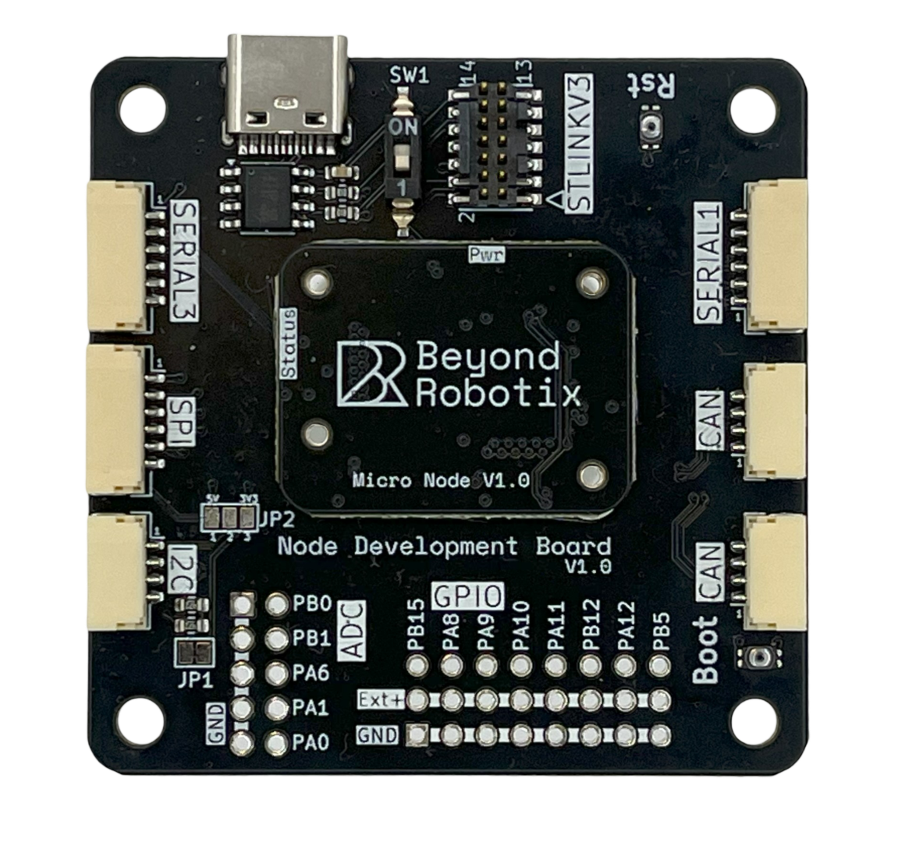

# Arduino DroneCAN

This repository allows easy integration of sensors to be used with Ardupilot and PX4 via DroneCAN. Sensors can be integrated within minutes by using pre-existing Arduino libraries for sensors, and through this library which abstracts the DroneCAN layer so you can focus on sending and receiving messages.

By using the Arduino core and PlatformIO with pre-configured board setups, you can start developing instantly.

This isn't intended to be used in the same way as AP_Periph, which supports tons of sensors all at once and is highly adaptable without writing code. This is intended for writing a DroneCAN interface for any sensor or system, without having to deal with a large code base and lots of boilerplate.

## Features

API changes can happen at any time in master. See the releases page to download a specific verison for your project.

- Send DroneCAN messages ✅
- Receive DroneCAN messages ✅
- Send NodeStatus ✅
- Respond to NodeInfo ✅
- Reboot on reboot request ✅
- Dynamic Node Allocation ✅
- DroneCAN Parameters ✅
- Firmware update over CAN ✅

## Currently Supported Hardware

This repository is plug and play with the Beyond Robotix CAN node series!

See [Beyond Robotix Can Node](https://www.beyondrobotix.com/products/micro-can-node-development-bundle)

### ⚠️ IMPORTANT: Beyond Robotics STM32L431 PWM Issues

**PA8/PA9 PWM requires special handling on Beyond Robotics STM32L431 board!**

- `Servo.attach(PA8/PA9)` fails due to I2C pin conflicts and Advanced Timer requirements
- **Solution**: Direct HAL TIM1 programming with `__HAL_TIM_MOE_ENABLE()`
- **Working implementation** included in this project (see `BEYOND_ROBOTICS_PWM_ISSUES.md`)
- **Both PA8/PA9 motors work** with DroneCAN remote control after HAL implementation

We've got some handy docs for the node hardware and some more software explaination and examples here [CAN node gitbook](https://beyond-robotix.gitbook.io/docs/can-node-system)

## Code Usage

See [Beyond Robotix Gitbooks ArduinoCAN documentation](https://beyond-robotix.gitbook.io/docs/can-node-system/arduino-dronecan) for more information!

## Support

If you get stuck with this repository, the discussions section will allow us to help out.

For dedicated engineering support on your application, contact [admin@beyondrobotix.com](admin@beyondrobotix.com). We can also quote for writing custom firmware for you!

## Repository structure

This repository is designed to be cloned and run straight away using the example application in ./src/main.cpp.

All 3 of the following libraries are required:

- ./lib/arduino_dronecan contains the library which has been written to make dronecan plug and play
- ./lib/dronecan contains the actual dronecan message types generated by dronecan_dsdlc
- ./lib/libcanard contains the canard library which handles parsing of dronecan messages

There is some platformio boilerplate to do to support new boards
- ./boards
- ./variants

The required repos to generate the dronecan messages etc are in ./dronecan, although ./lib already contains the generated files so these are just for reference.

## Standing on the shoulders of Giants.

This repo is built on many resources:
- Arduino Core https://github.com/stm32duino/Arduino_Core_STM32
- Basis of the CAN API https://github.com/nopnop2002/Arduino-STM32-CAN/blob/master/stm32l452/stm32l452.ino#L55
- How to use libcanard https://github.com/dronecan/libcanard/blob/master/examples/ServoNode/servo_node.c
- https://github.com/seeers/CAN-Bus-Arduino_Core_STM32/blob/master/CanLowlevel.ino
- https://github.com/geosmall/UAVCAN-for-STM32-Arduino/blob/master/libcanard_example/src/libcanard/drivers/stm32/canard_stm32.c
- the platformio board is based on this being the closest supported board https://docs.platformio.org/en/latest/boards/ststm32/nucleo_l432kc.html
- These are the HAL drivers for the specific MCU being used, although they're all generic https://github.com/stm32duino/Arduino_Core_STM32/tree/main/variants/STM32L4xx/L431C(B-C)(T-U)

Other stuff which didn't get used but interesting 
- https://github.com/UBC-Solar/firmware-v2/tree/master
- https://github.com/geosmall/UAVCAN-for-STM32-Arduino/blob/master/libcanard_example/src/libcanard/drivers/stm32/canard_stm32.c
- https://github.com/pazi88/8Ch-EGT
- https://github.com/J-f-Jensen/libraries/blob/master/STM32CAN/STM32CAN.cpp
- https://github.com/Dmivaka/STM32-HAL-Libcanard/tree/main

Other notes
- No CAN API support in STM32 Arduino https://github.com/stm32duino/Arduino_Core_STM32/issues/259
- The HAL drivers are generated for L431 but not working https://community.st.com/t5/stm32cubemx-mcus/the-stm32cubeide-does-not-generate-the-stm32h7xx-hal-driver-file/td-p/101970

## Dronecan DSDLC

If you want to generate the dronecan message headers from scratch, ensure you have the submodules cloned, then:

> cd dronecan

> python dronecan_dsdlc/dronecan_dsdlc.py -O ../lib/dronecan

[dronecan generate files](https://github.com/dronecan/dronecan_dsdlc)
