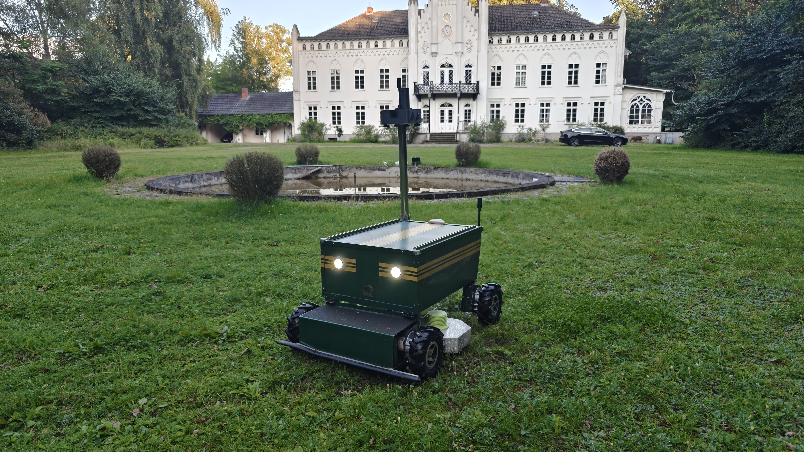

# Image Gallery — Quassel UGV

Photos of the production vehicle, taken on 2026-08-10 in the manor park at
Lübtheen. All descriptions below are limited to what is actually visible in the
photo; no dimensions or mounting positions are inferred from the pictures.

---

## `main.jpg` — Title image: front view in the park

The vehicle seen head-on from a low angle on the lawn, with the manor house and
the round ornamental basin behind it. The dark green body carries two gold
stripes on each side of the front panel, two round LED headlights (switched on)
and the gold `Q` marque below them. The mast rises from the vehicle body and
carries the sensor enclosure at its top; a white dome antenna and a short black
whip antenna sit on the upper deck of the body. The mowing deck with its front
skid bar is attached ahead of the body, and the knobbly tyres on their direct
hub drives are visible on both sides. This is the reference shot used as the
repository title image.

---

## `IMG20260810194808.jpg` — Side view with raised mast

Portrait shot from the rear left on the lawn next to a cobbled path. The full
height of the mast is visible: a polished tube, braced diagonally against the
body, carrying the grey sensor enclosure with two lenses in its front face, a
short black antenna and a larger black cylinder on top. Underneath the body the
open equipment bay shows the light-green modules and the red/black power
harness; the wheels with their direct hub motors are shown unobstructed. Good
overview of the overall proportions of chassis, drive and mast.

---

## `IMG20260810194830.jpg` — Top view of the body cover

Close-up looking down at the upper deck. The green cover panel with the gold
centre stripe, the aluminium edge rails and the recessed pull handle are
clearly visible, as are the cable ties along the rear edge and the clamped
foot of the mast on the right-hand edge. Below the rear edge two wheels with
their hub motors and motor cabling can be seen. Useful as a detail shot of the
cover, its mechanical fixings and the cable routing.

---

## `IMG20260810195032.jpg` — Wide shot: vehicle in front of the manor

Wide landscape view of the whole scene. The neo-Gothic manor with its central
tower and clock forms the background, the empty round basin the middle ground,
and the UGV stands small and centred on the cobbled apron at the rim of the
basin. Shows the working environment and the scale of the mowing area rather
than the vehicle itself.

---

## `IMG20260810195101.jpg` — Wide shot: vehicle at the basin, headlights on

Same viewpoint as the previous shot but closer and with the headlights lit. The
vehicle sits at the edge of the basin on the cobbled ring, mast up. The lawn in
the foreground shows the mown surface the system operates on, and the basin
edge and the shrubs around it are exactly the kind of obstacles the geofence
and no-go zones must keep the vehicle away from.

---

## `IMG20260810195126.jpg` — Vehicle on the lawn in front of the basin

Landscape shot from further forward. The UGV stands free on the grass ahead of
the basin, seen from the front left with both headlights on, mast raised and
sensor enclosure at the top. The manor, the basin and the ring of clipped
shrubs are all in frame, which makes this the clearest picture of the vehicle
in its operating context.

---

## `IMG20260810195204.jpg` — Rear three-quarter view on the open lawn

The vehicle photographed from the rear right on an open patch of lawn in front
of a treeline, without the manor in the background. The mast with the grey
sensor enclosure, the diagonal mast brace and the cabling from the body to the
mast are clearly readable. Under the body the equipment bay is open to view:
the light-green modules, the light-coloured mounting plate and the wiring
harness. The best photograph for showing the drive and equipment layout.

---

## `IMG20260810195217.jpg` — Close front view with mowing deck

Front three-quarter view from close range at ground level. The front panel with
both lit headlights, the gold stripes and the `Q` marque fills the frame; ahead
of it the mowing deck with its front skid bar and the knobbly tyres of the
front axle. The mast and its sensor head rise out of the top edge of the frame.
The manor and the basin remain visible in the background. Suitable as an
alternative title image.
